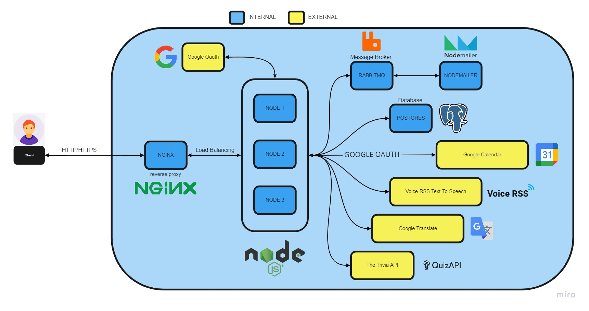

# Trivia Stack 

Progetto Reti di Calcolatori

- Tamer Hayek
- Maria Diana Calugaru
- Samuele Cervo

Il nostro progetto implementa un quiz a tempo illimitato. Per poter giocare basta registrarsi oppure effettuare il login con Google. Una volta effettuato il login, l'utente può scegliere una o più categorie per le domande della partita e cominciare a giocare nel tentativo di raggiungere un nuovo record e salire nella classifica generale del gioco. Durante il gioco viene data la possibilità di riprodurre le domanda come audio in inglese o italiano. Inoltre, se il giocatore ha effettuato il login con Google, alla fine di ogni partita sarà aggiunto al suo calendario un evento che riporta informazioni relative a quella partita e il punteggio conseguito.

# STRUTTURA DELL'APPLICAZIONE


## Soddisfacimento dei requisiti e tecnologie usate

- Il servizio REST che implementiamo (SERV) deve offrire a terze parti delle API documentate:
    API documentate tramite APIDOC accessibili dal seguente file:
   ```
   /apidoc/doc/index.html
   ```
   Servizi offerti:
   - classifica del gioco (si può scegliere di quanti utenti si desidera la classifica)
   - statistiche sulle categorie di domande più scelte dai giocatori


- SERV si deve interfacciare con almeno due servizi REST di terze parti:
    - Google Calendar: per creare/aggiungere eventi al proprio calendario
    - Google Translate: per tradurre le domande dall'inglese a italiano
    - The Trivia Api: per estrarre casualmente domande
    - Voice-RSS Text-To-Speech: per poter riprodurre le domande

- Almeno uno dei servizi REST esterni deve essere “commerciale”
    - Google (Calendar & Translate)

- Almeno uno dei servizi REST esterni deve richiedere oauth:
    - Google Calendar: tramite accesso Oauth

- La soluzione deve prevedere l'uso di protocolli asincroni:
    - AMQP usato per l'invio di una e-mail di conferma registrazione alla nostra applicazione

- Il progetto deve prevedere l'uso di Docker e l'automazione del processo di lancio, configurazione e test
    - applicazione gestita su più container di Docker

- Il progetto deve essere su GIT  
    - GitHub utilizzato per favorire lo sviluppo e il coordinamento
- Deve essere implementata una forma di CI/CD:
    - Procedura di CI/CD attraverso Github Actions
- Requisiti minimi di sicurezza devono essere considerati e documentati.    
    - Certificati self-signed
#### Altre tecnologie usate
- Nginx: web server usato anche come proxy server e load balancer
- Postgres: utilizzato per il Data storage degli utenti e delle categorie di domande
- Node.js: utilizzato il back-end
- Pug: utilizzato come template per le pagine
- Css: utilizzato per i fogli di stile
- Express.js: utilizzato come framework 

## Guida all'uso
Clonare la repository del nostro progetto e spostarsi all'interno della directory progetto-reti:
```
git clone https://github.com/tamerhayek00/progetto-reti
cd progetto-reti
```
Controllare che Docker sia in esecuzione.
Avviare il progetto tramite i comandi:
##### ON Windows
```
.\start_all.bat
```
##### ON Linux/MacOS
```
./start_all.sh
```

Questi due script rimuovono i container già esistenti, per ricrearli poi da zero ed effettuare successivamente i test della nostra applicazione.

Una volta messa sù l'applicazione vengono creati 7 container e 3 reti all'interno di Docker:
- Containers
    - Nginx
    - Node (3 istanze per il load balancing)
    - Postgres
    - Nodemailer
    - RabbitMQ
- Reti
    - app
    - db
    - amqp

Per accedere al servizio da un browser andare su:
```
http://localhost:80
```
oppure su:
```
https://localhost:443
```

## Test
I test sono stati eseguiti tramite il modulo Mocha.
Nella root del progetto si trova il seguente file:
```
test.js
```
Installare Mocha globalmente e poi installare gli altri moduli necessari:
```
npm install mocha -g && npm i
```
Si eseguono lanciando nella directory del progetto il comando:
```
npm test
```


